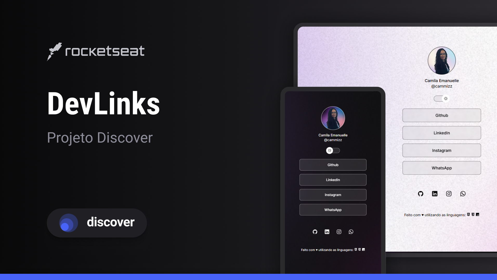

<h1 align="center"> 🔗 DevLinks </h1>

Projeto desenvolvido durante a jornada <strong>Discover</strong> da <a href="https://www.rocketseat.com.br/">Rocketseat</a>.

  <a href="#-sobre-o-projeto">Sobre</a>&nbsp;&nbsp;&nbsp;|&nbsp;&nbsp;&nbsp;
  <a href="#-tecnologias-e-aprendizados">Tecnologias</a>&nbsp;&nbsp;&nbsp;|&nbsp;&nbsp;&nbsp;
  <a href="#-layout">Layout</a>&nbsp;&nbsp;&nbsp;

 

  

## 💻 Sobre o Projeto

O **DevLinks** é um agregador de links personalizado, ideal para ser utilizado como um "cartão de visitas" digital ou link na bio para redes sociais. 

Esse projeto foi adaptado com minhas principais redes sociais e meios de contato, sendo meu **Portfólio pessoal**.

## 🚀 Tecnologias e Aprendizados

Este projeto foi fundamental para consolidar meus conhecimentos em:

- **HTML5**: Estruturação semântica de elementos.
- **CSS3**: Trabalhando com variáveis (custom properties), pseudo-classes, flexbox e media queries para responsividade.
- **JavaScript**: Manipulação da DOM para criar a funcionalidade de troca de tema e lógica de condições.
- **Git & GitHub**: Versionamento de código e publicação através do GitHub Pages.
- **Figma**: Interpretação de protótipos profissionais para conversão em código real.

## 🔖 Layout

O design do projeto foi baseado na comunidade do Figma:
- [Acesse o layout original aqui](https://www.figma.com/community/file/1187422022288947321)

---

## 🔗 Link para o Projeto
Você pode visualizar o projeto finalizado e online clicando no link abaixo:

👉 **[Acesse o meu DevLinks aqui](https://cammizz.github.io/Projeto-Discover-Portfolio/)**

---

Desenvolvido com dedicação durante o aprendizado no Discover da Rocketseat 🚀

